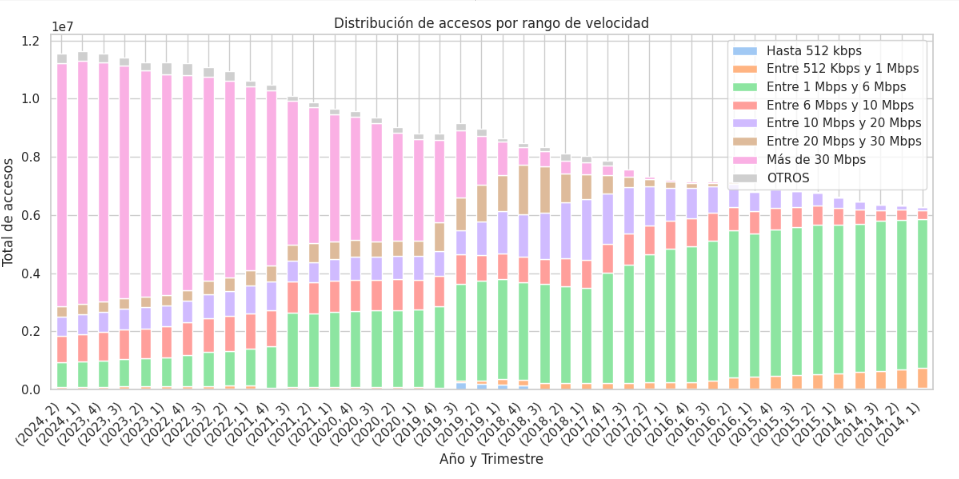
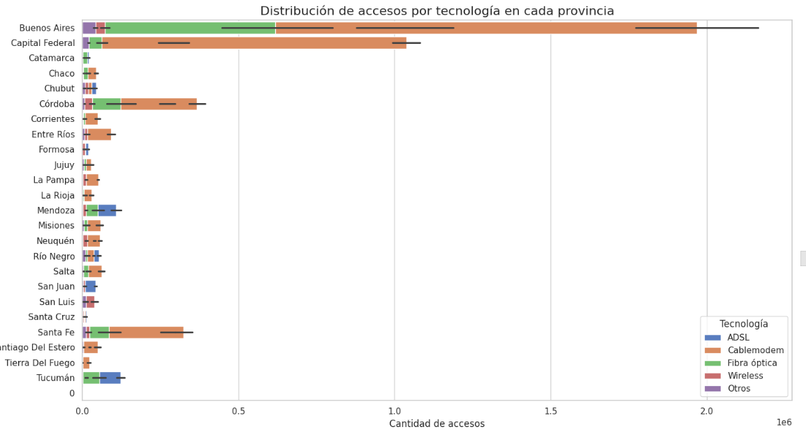
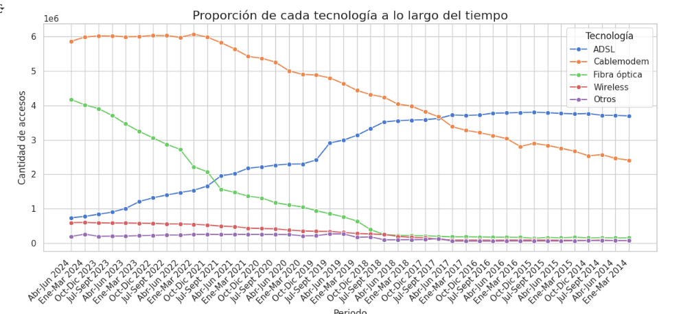
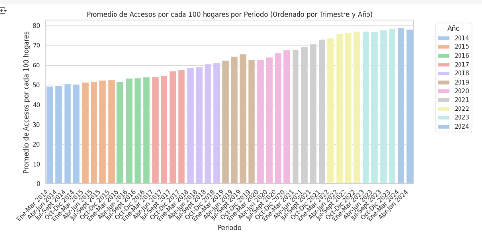
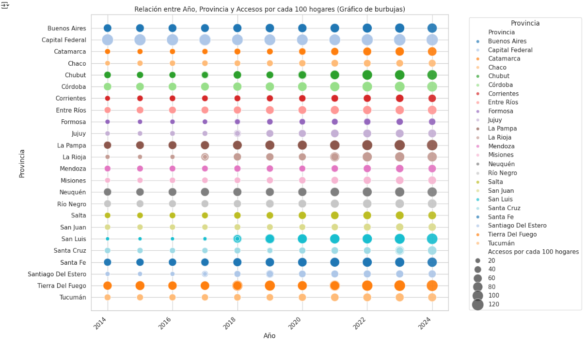

# <h1 align=center> **PROYECTO INDIVIDUAL Nº2** </h1>
# <h1 align=center> **Ruth Castañeda Bojorques** </h1>

# <h1 align=center>**`Telecomunicaciones`**</h1>


## ```Introducción```

Desde tiempos antiguos, la humanidad ha buscado superar las barreras de la distancia para comunicarse, y en la actualidad, las telecomunicaciones han revolucionado esta interacción. A través de medios como la telefonía, la radio, la televisión y el internet, es posible transmitir información entre personas, organizaciones y dispositivos, incluso a grandes distancias.

El internet, como red global de computadoras, ha transformado profundamente nuestras vidas al permitir la transmisión de datos en tiempo real. Esta herramienta ha cambiado cómo nos comunicamos, trabajamos, aprendemos y nos entretenemos, consolidándose como una parte esencial de la vida moderna. La industria de las telecomunicaciones ha sido clave para mantenernos conectados, facilitando la difusión de información incluso en situaciones adversas como una pandemia.

En este marco, se me ha encargado un análisis detallado del sector de las telecomunicaciones a nivel nacional. El objetivo es evaluar el comportamiento del mercado, centrándose en los servicios de internet y otras formas de comunicación, para identificar oportunidades de mejora en la calidad del servicio, áreas de crecimiento y soluciones personalizadas para los clientes.


## :white_check_mark: ```Objetivos ```

- :pushpin: Llevar a cabo un análisis detallado sobre el desempeño del sector de telecomunicaciones en Argentina, poniendo énfasis en el acceso a internet y otros servicios relacionados.
- :pushpin: Definir indicadores clave de desempeño (KPIs) que permitan evaluar la eficiencia y calidad de los servicios ofrecidos.
- :pushpin:  Identificar oportunidades de crecimiento y expansión dentro del mercado, considerando la penetración de internet y la incorporación de nuevas tecnologías de comunicación en diversas regiones del país.

## :white_check_mark: ```Desarrollo del Proyecto```

Para alcanzar los objetivos planteados, se realizó un análisis completo de los datos obtenidos desde https://indicadores.enacom.gob.ar/datos-abiertos. Este estudio se enfocó principalmente en el acceso a internet y otros servicios de comunicación. Se aplicaron diversas técnicas de Análisis Exploratorio de Datos (EDA) para abordar aspectos como la identificación de valores ausentes, detección de datos atípicos y registros duplicados, además de generar visualizaciones claras y consistentes que facilitaron la interpretación de los resultados.

**Resultados más destacados del EDA:**

### :globe_with_meridians: Velocidad de Conexión a Internet por Provincia

El análisis de los datos ha permitido mostrar  una tendencia clara de aumento en las velocidades de conexión a internet a lo largo de los años en Argentina.



### :globe_with_meridians: Accesos a Internet por Tipo de Tecnología

Se puede observar que Buenos Aires sigue siendo la provincia con el mayor número de accesos en todos los tipos de conexión, lo que refleja una infraestructura de telecomunicaciones avanzada y una fuerte demanda de servicios de internet. Además, se destaca una marcada desigualdad entre las provincias en términos de acceso a diversas conexiones, lo que podría señalar variaciones en el desarrollo tecnológico e infraestructura a nivel regional.



La evolución del acceso a internet según el tipo de conexión, desde 2014 hasta el primer trimestre de 2024, evidencia un cambio hacia tecnologías más avanzadas y rápidas, como el Cablemódem y la fibra óptica, en lugar del ADSL.




.

### :globe_with_meridians: Penetración de Internet en Hogares
La penetración promedio de internet en los hogares de Argentina ha mostrado un crecimiento sostenido desde 2014 hasta 2024 y el aumento es notable en los últimos años, especialmente a partir de 2020. Se observa nuevamente que la penetración es más alta en provincias como Buenos Aires y Capital Federal. Hay provincias con menor crecimiento relativo que han mejorado, pero a un ritmo más lento.






## 🏆 Indicadores Claves de Rendimiento (KPIs)


KPI :one: : **Acceso al servicio de Internet**

*  Métrica: Esta métrica se basa en medir el incremento porcentual del acceso al servicio de internet en cada provincia, calculando el número de hogares con acceso a internet por cada 100 hogares.

* Datos Necesarios: Número de hogares con acceso a internet en el trimestre actual y número proyectado de hogares con acceso a internet para el próximo trimestre.

* Objetivo: Aumentar en un 2% el número de hogares con acceso a internet por cada 100 hogares en cada provincia para el próximo trimestre.
  
  
## :pencil: Dashboard

Se desarrolló un dashboard en PowerBi que permite explorar detalladamente los datos mediante filtros interactivos, facilitando la interpretación de la información y apoyando las sugerencias informadas para mejorar la calidad del servicio, identificar áreas de inversión y desarrollar soluciones personalizadas para los clientes.


## :white_check_mark: Contenido del repositorio

* IMAGES: Carpeta que contiene imágenes del readme

* EDA_PI02.ipynb: Archivo Jupyter Notebook que contiene el código en Python desarrollado para la realización del EDA.

* README.md: archivo que contiene la descripción del proyecto

## :white_check_mark: Herramientas Utilizadas

* ${\color{red} \textbf{Google Colaboratory}}$: Se utilizó esta plataforma para el desarrollo del proceso EDA.

* ${\color{red} \textbf{PowerBi}}$: Se utilizó este servicio de análisis de datos de Microsoft.

##  Contacto 
ruthcastanedab@gmail.com
